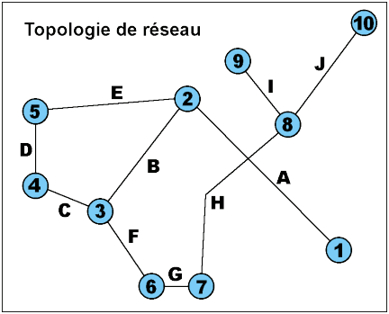

# Topologie

Bien qu'INSPIRE n'en fasse pas une obligation, la modélisation ci-après reprend le modèle générique de réseau tel qu'utilisé dans les spécifications du thème _Utility and Government Services_.
La topologie en deux dimensions adoptée ici est donc une topologie de graphe, qui décrit la relation entre arcs (représentés par des lignes ou des polylignes) et nœuds (représentés par des points) et inscrit le référencement des nœuds dans la description des arcs. Le modèle est ainsi relationnel.

Dans une telle topologie, illustrée par la figure ci-après :

1. Tout objet (ponctuel ou linéaire, nœud ou arc) est en relation topologique avec au moins un autre objet ;

2. tout arc joint deux nœuds (ceux dont la localisation coïncide avec celle de ses extrémités), tel l'arc H et les nœuds 7 et 8 ou l'arc A et les nœuds 1 et 2 ;

3. deux arcs ou plus peuvent se croiser sans être connectés, tels les arcs A et H ;

4. un nœud :
   
        - soit constitue une terminaison du réseau, tels les nœuds 1, 9 et 10,
        - soit connecte deux arcs (tel le nœud 7 et les arcs G et H) ou plus (tel le nœud 3 et les arcs B, C et F) par leurs extrémités.

Cette modélisation constitue le méta-modèle conceptuel sur lequel s’appuie le présent Géostandard. Ce méta-modèle de graphe définit ainsi des super-entités, de nature de nœud et d’arc, parentes des entités-métiers de type graphique point et ligne qui leur sont associées par le système relationnel pour décrire le patrimoine métier.

Étant appliqué aux systèmes d’eaux (Adduction en Eau Potable et Assainissement Collectif), cette topologie noeud-arc-noeud est donc à décliner :

* au **graphe de réseau**, réseau de production ou de distribution d’eau / réseau d’assainissement collectif unitaire ou séparatif (eaux usées et eaux pluviales urbaines) constitué par tous les patrimoines de nature de canalisations (tuyauterie) et équipements (organes, pièces...) ponctuels divers le jalonnant, ce pour chaque réseau indépendant ;
* au **graphe de branchement**, branchement constitué par les patrimoines de nature de canalisations (tuyauterie) et équipements (organes, pièces...) ponctuels divers le jalonnant, ce pour chaque branchement.

La jonction entre les deux graphes, à savoir d’un point de vue métier le piquage ou raccordement d’un branchement sur/au réseau de desserte / collecte, est modélisé de façon relationnelle également, par le placement d’un nœud de branchement. Ce nœud appartient au graphe de branchement et une entité ponctuelle fille incarnant le dispositif de raccordement qui lui est associée. Le comportement de ce nœud de branchement vis-à-vis du graphe de réseau peut être de deux types selon son positionnement :

* soit il appartient à l’arc du réseau au point en son sein où il est positionné. Ainsi, il ne le « coupe » pas ;
* soit il est lié à un nœud du graphe de réseau au droit duquel il est positionné. Ainsi, est-il le fils du nœud de réseau lequel « coupe » l’arc de réseau.

Le nœud de branchement, porteur de l’entité métier incarnant le dispositif de raccordement, à la jonction des graphes de réseau et de branchement est en relation avec une canalisation de réseau, soit directement (cas plutôt rencontré en Adduction en Eau Potable), soit par l’intermédiaire d’un nœud du graphe de réseau (cas plutôt fréquent en Assainissement Collectif dans la mesure du raccordement de branchements au droit de regards de visite).

Pour rappel, l’usage des nœuds dans la topologie de graphe détermine le découpage nœud-arc-nœud, lequel, selon les règles de l’art, est basé sur l’occurrence de propriétés métiers (structurelles, dimensionnelles et fonctionnelles) homogènes pour décrire un même arc, et donc sur l’occurrence d’au moins une caractérisation différente parmi ces propriétés au changement d’arc. Dès lors, d’un point de vue métier, certains équipements, organes ou pièces peuvent ne pas être discriminants quant aux propriétés descriptives des tuyauteries de part et d’autre.

Pour répondre à ce besoin de modélisation de la diversité du monde réel, le géostandard, en la présente version, autorise pour certaines entités métiers de type graphique point qu’elles soient filles de nœud ou bien d’arc, la maille de discrétisation du graphe par des nœuds étant laissé au choix constructif de l’utilisateur du géostandard. D’autre part, le géostandard définit également en tant que de besoin des entités de type graphique point ou ligne hors topologie de graphe avec possibilité d’association simple (attributaire) le cas échéant.

Les entités du géostandard de type graphique surface ne font pas partie de la topologie de graphe. Pour autant, le méta-modèle définit également et par analogie une super-entité, parente d’entités métier de même type graphique. Des associations simples peuvent exister entre entités de la partie topologique du modèle et entités de la partie non topologique du modèle quel que soit leur type graphique.

Les choix de traduction et de dénormalisation éventuelle des modèles conceptuel et logique, ici décrits pour le géostandard, au niveau physique est laissé aux utilisateurs géomaticiens et gestionnaires de base de données du géostandard.